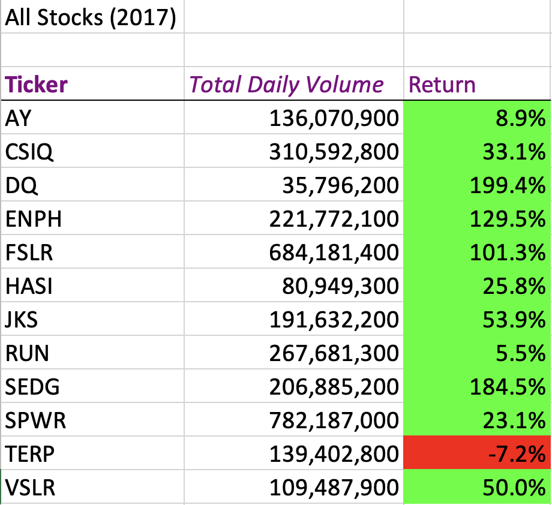
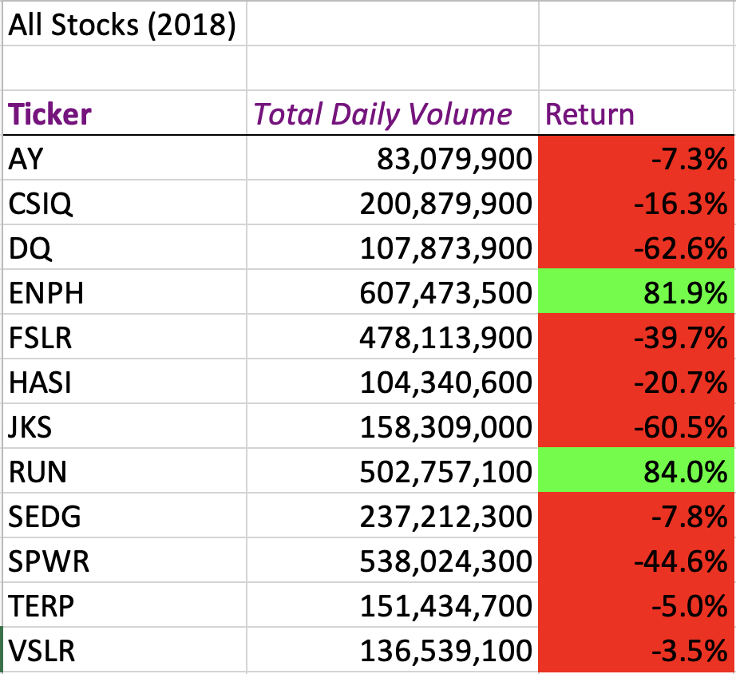
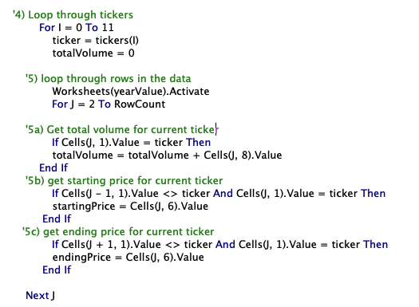
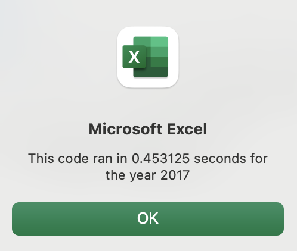
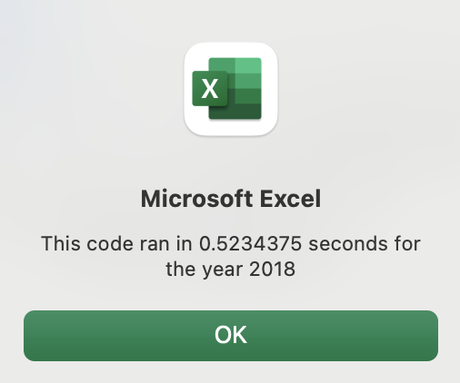
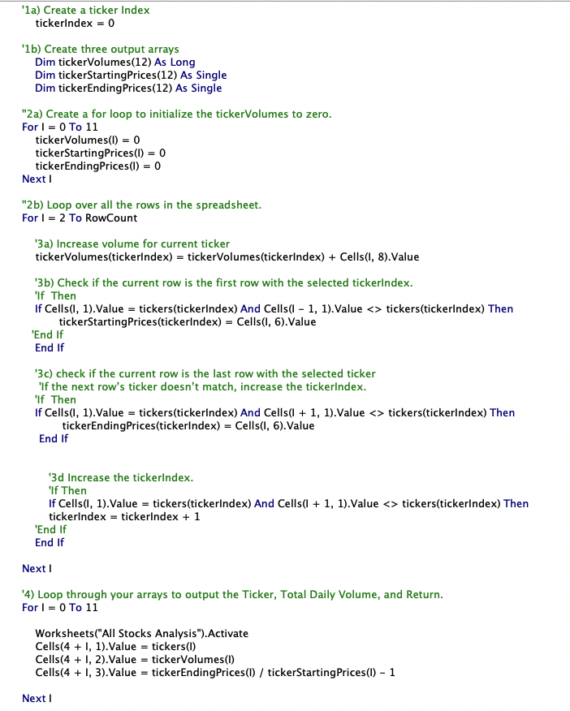
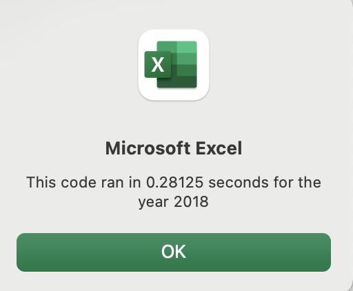
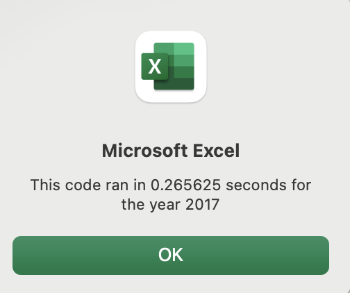

# Stock Analysis 
---
## Overview 

This paper looks at 12 green energy companies stock performances over 2017 and 2018, and ultilises VBA script to determine the total daily volumne and return. It will then provide an analysis on how and why code refactoring is advantageous, as well as providing some insight into challenges and disadvantages of refactoring code both in this example and in general. 

## Purpose 

The aim of this paper is to determine the total daily volumne, and return, for 12 green energy companies, for 2017 and 2018, alongside comparing the execution times of the orignal and the refractored VBA script. This paper aims to determine whether refractoring code allows the VBA script to run faster. 

---

## Analysis and Resutls 

### Stock Market Performance 
Using both the original code and the refactord code, a comparison of stock performance between the year 2017 and 2018 can be made. Below is a table illustrating the number of trades of the stocks in a given day, which is represented by "Total Daily Volumne', as well as return on investment, 'Return'.

With the use of conditional formatting in VBA, cell colours turn red when the outcome is a negative return, a green for a positive one, which allows for a simplisitic illustration of the data. It is shown that in 2017, only 1 ticker, ‘Terp’, saw a negative return, in comparrion to 2018, where all but 2 tickers saw a negative turn. 

This data implies that two stocks, ENHP and RUN, would’ve been a good investment as they’re the only two stocks that saw positive returns in both 2017 and 2018. 

### Refactoring Analysis

The second aim of this paper was to refractor the code to loop through all the data once, collecting the same information, and determining whether the refactord code made the script run faster. 

The difference between the original and refactord script was the use nested loops in the original script. A nested loop is a loop inside of a loop, which essentially tells the computer to repeat the code for as many loops that are outlined. The loop in the original script in show below: 

Here the computer is running through each record of the data set once for each possible ticker. 

  

By using the code above, the script ran in 0.453 seconds for the 2017 Analysis, and 0.523 seconds for the 2018 Analysis.

In order to make this script run quicker, we can refactor the code and remove the nested loop and create and array (see image below). Instead of the computer running through each record of the data set once for each possible ticker, it’ll run through the data set only once overall. 

With this modification, the script now runs in 0.281 seconds for the 2017 Analysis and 0.266 seconds for the 2018 Analysis. 

  

---

## Summary

This analysis shows that all bar 1 company, (ticker: TERP), saw a positive return on investment in 2017, and all bar 2 (ENPH and RUN) saw a negative return in 2018. This indicates that only two stocks, ENHP and RUN, would’ve been a good investment as they’re the only two stocks that saw positive returns in both 2017 and 2018. 

This paper also demonstrates that well refactord code reduces the time it takes to run the script. This example saw a decrease in 0.172 seconds and 0.258 seconds for the 2017 and 2018 Analysis, retrospectively. 

### Advantages of refactoring code 

1.	Maximises overall efficiency as code is steamlined, as fewer steps is needed, and less memory is used, which reduces running time 
    * In this example we saw a reduction in time to run analysis

2.	Improves readability which makes it easier for future users to read 
    * In this example, if another user wants to analyise 2019 trends, they can clearly see and edit the refactored code used here

### Disadvantages of refractoring code 

1. Likely to cause issues on a code which already works as refactoring code means removing and altering code, which breaks it at first. If the fix isn’t obvious, it can be hard locating the root issue, causing debugging to be more difficult.
  *	In this example, it took a few tries to run and rebug the code before the error was found.

2. Can be time consuming and costly process
  * In this example it was stated to change the loop to an array, but in general this might not be as obvious and it takes time to refracture code, which can be costly. Still in the example, is was very time consuming and cost much sanity. 

